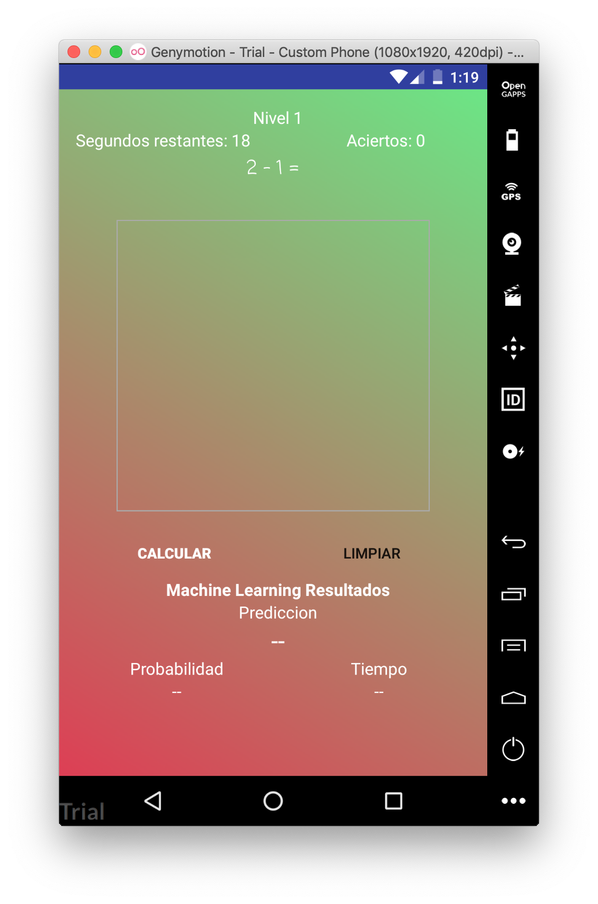
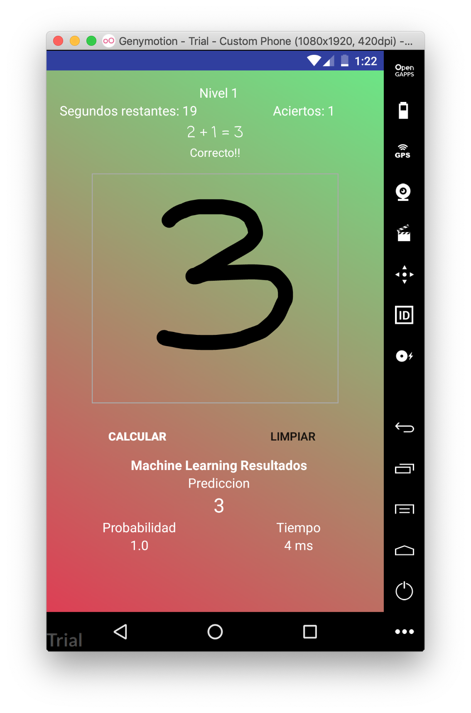
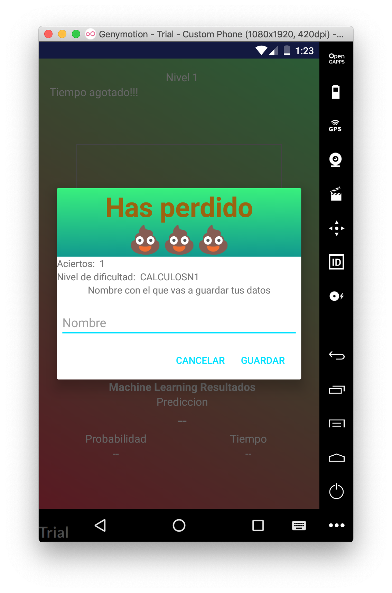
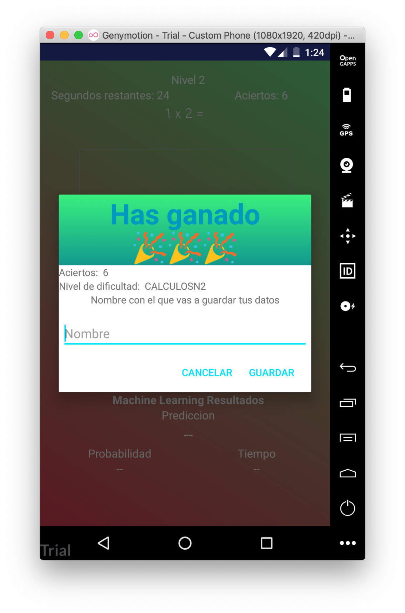
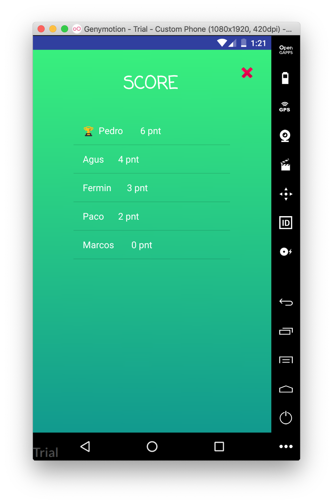

# Android-Java-MachineLearning-Game
Este es un juego de cálculos donde se usa Machine Learning para detectar que número se ha dibujado en la pantalla,
El juego es simple, tienes que ir resolviendo los calculos que te aparecen en la pantalla y con un modelo entrenado en Machine Learning para detectar números se puede saber que número ha dibujado en la pantalla, el proyecto esta pensado que a medida de que vas resolviendo calculos, mas dificiles son estos.

Todos los calculos que hay que hacer y el guardado de los nombres al perder o ganar se gestiona desde una base de datos en Firebase

Debido a que esto era un proyecto final para una asignatura, el número de calculos y la dificultad no es muy elevada para que se vea toda la funcionalidad.

El programa es una App para Android desarrollada con Java

Estas son algunas imágenes de la app:

